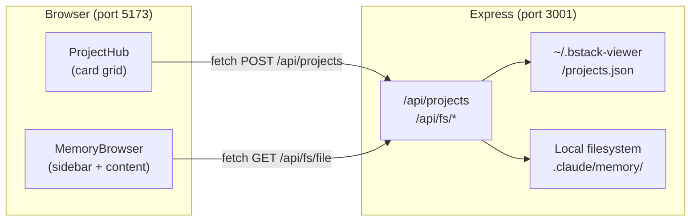
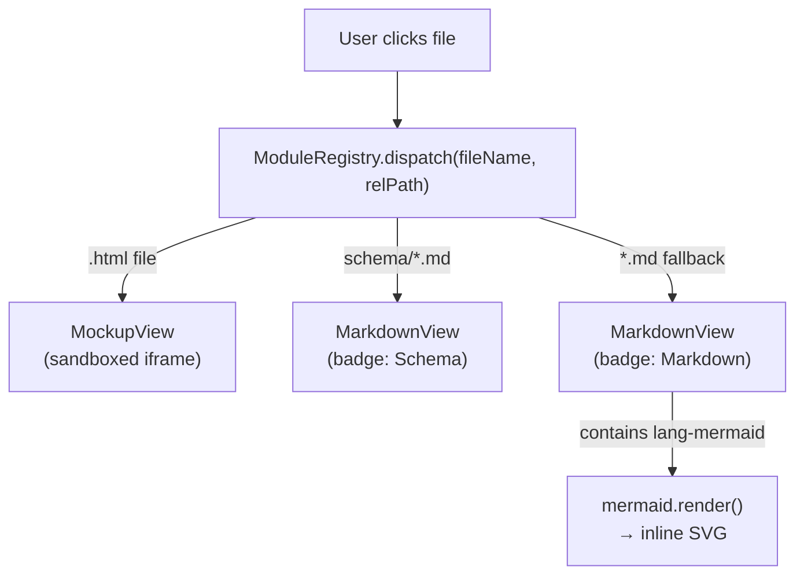

# Schema Index

No database. All persistence uses a **JSON file** at `~/.bstack-viewer/projects.json`.

## Data model: Project

```ts
type Project = {
  id: string          // uuid — generated on add
  name: string        // display name, inferred from folder name
  rootPath: string    // absolute path to project root (parent of .claude/)
  lastOpened: string | null  // ISO timestamp
  coverTheme?: string // one of the THEMES ids in ProjectHub.tsx
  coverEmoji?: string // optional emoji shown on card banner
}
```

### Rules
- `rootPath` must point to a directory that contains `.claude/memory/`
- `id` is stable — never regenerate for an existing project
- `lastOpened` is updated each time the user opens the project
- `coverTheme` falls back to auto-assignment (hash of project name) when absent

## Architecture overview



## Content dispatch



## Future
- Per-project settings (custom quick links)
- Window state persistence (last active project)
